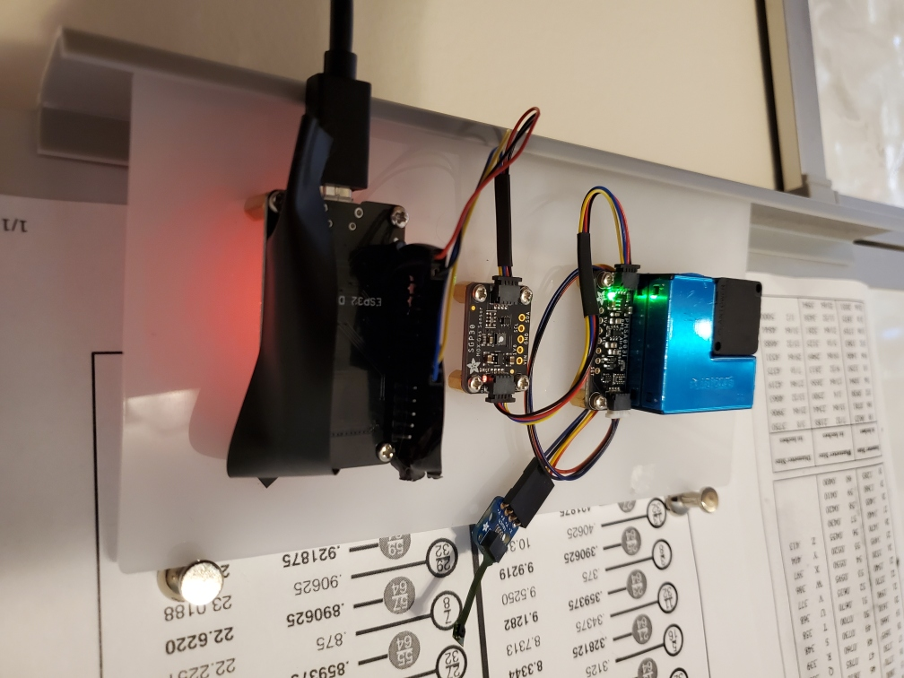

# jantman/glowforge-projects/air_quality_sensor_mounting_plate

Mounting plate for an air quality sensor made up of an ESP32 clone, an [Adafruit SGP30](https://www.adafruit.com/product/3709) equivalent carbon dioxide (eCO2) and total volatile organic compounds (TVOC) and an [Adafruit PMSA003I](https://www.adafruit.com/product/4632) particulate size and concentration sensor. All are mounted on standoffs.

The code for the sensor is at: https://github.com/jantman/home-automation-configs/blob/master/wemos_d1_mini/air_sensor.py

This is intended to be cut on a GlowForge Pro, out of 1/8" Lucite "L" cast acrylic. Settings from [Delvies Plastics](https://www.delviesplastics.com/blog/glowforge-acrylic-laser-settings.html) are speed 160, power FULL, 1 pass, focus height 0.12 inches.
