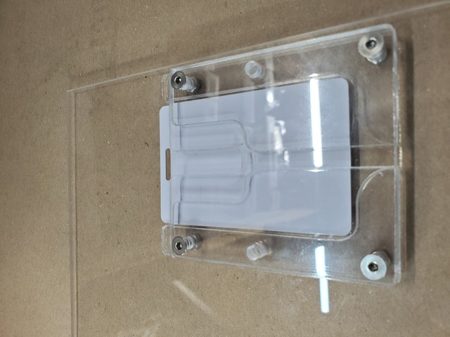
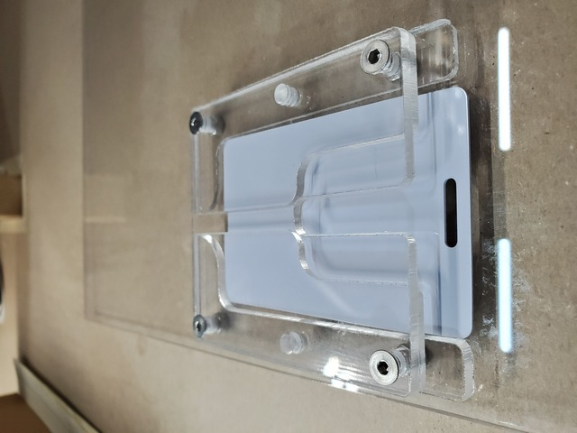
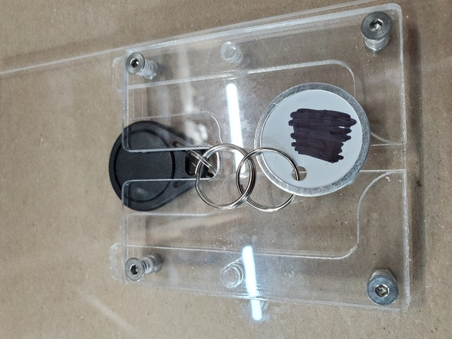
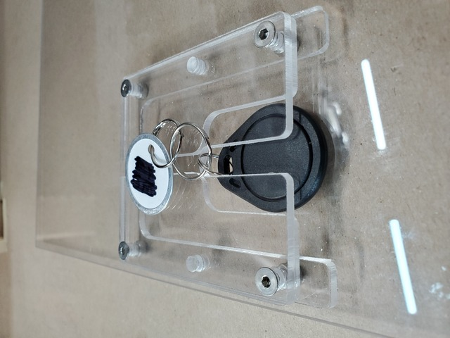

# RFID Card/Fob Holder

A holder/pocket for RFID cards and fobs to align and hold them over a RFID reader; designed for [https://github.com/jantman/machine-access-control](https://github.com/jantman/machine-access-control).

Each unit is made up of one top piece, two symmetrical middle pieces, and two symmetrical bottom pieces.

These are intended to be cut from 3mm (0.111" actual) clear cast acrylic. A lightburn file for DecaturMakers' 100W Thunder Nova 35 (Brontē) using the standard 2" lens, 6mm (large) nozzle, internal air is included as [four-up-12x12_DM-ThunderNova35-Bronte.lbrn2](four-up-12x12_DM-ThunderNova35-Bronte.lbrn2).

* [top.svg](top.svg) - The top piece.
* [middle.svg](middle.svg) - Just a single middle piece.
* [bottom.svg](bottom.svg) - Just a single bottom piece.
* [one-up.svg](one-up.svg) - All parts for one holder.
* [two-up.svg](two-up.svg) - All parts for two holders.
* [four-up-12x12.svg](four-up-12x12.svg) - Parts for four holders packed onto a 12"x12" sheet.

